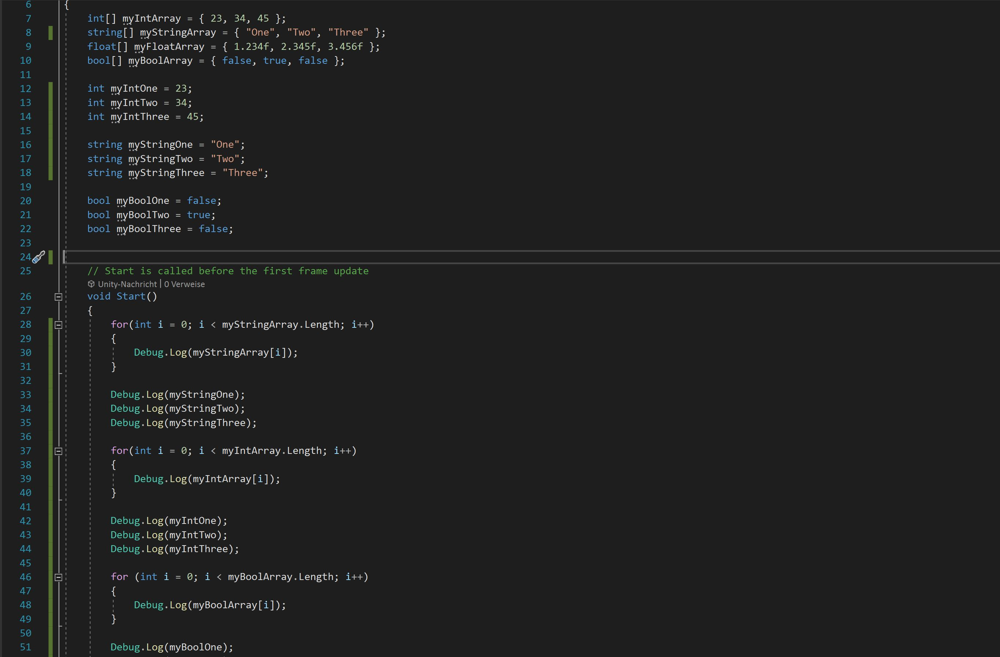
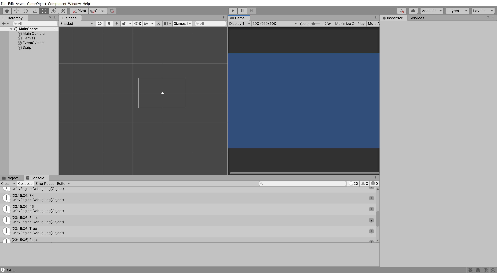

# arrays-pklacher

### Project description: 
Project to try out first things with arrays.

### Development platform: 
Windows 10, Unity Version 2020.1.5f1, Visual Studio 2019

### Target platform: 
WebGL, reference resolution 960x600

### Visuals: 

### Necessary setup/execution steps: 
none

### Third party material: 
none

### Project state: 
Finished

### Limitations: 
none

### Lessons Learned: 

<ul>
  <li> How to declarate Arrays</li>
  <li> How to print arrays in console</li>
</ul>
 
Copyright by Pia Lacher
